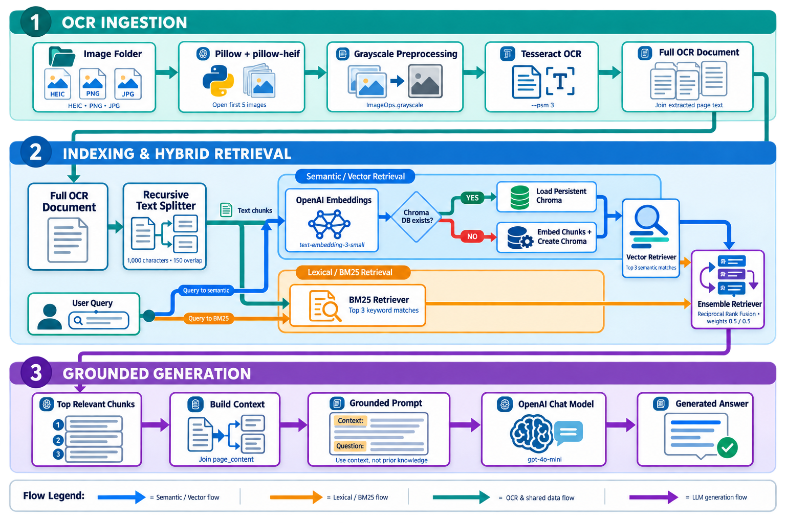

# LexisNexis OCR RAG Prototype
This repository contains a small OCR-to-RAG experiment built in Python.
It extracts text from document images, chunks the result, stores embeddings, and answers questions.
The current implementation lives in `RAG.py`.
## Project Preview

## What The Script Does
1. Loads environment variables from `.env`.
2. Opens image files from a target document folder.
3. Uses Tesseract OCR to extract text from the first five images.
4. Splits the combined text into overlapping chunks.
5. Builds or reuses a Chroma vector store in `chrome_db`.
6. Combines semantic retrieval with BM25 lexical retrieval.
7. Sends the retrieved context to `gpt-4o-mini` for final answering.
## Dependencies

The project currently depends on OpenAI, Chroma, LangChain, Pillow, and Tesseract-related packages.
Install the Python requirements with:
`pip install -r requirements.txt`

## Environment Setup

Create a `.env` file with your OpenAI API key:
`open_api_key=your_key_here`
The script reads this value during startup.

## Important Notes

The OCR source folder is hard-coded in `RAG.py` as `/Users/mubaraq/Downloads/Deloitte`.
The Tesseract binary path is also hard-coded for Apple Silicon at `/opt/homebrew/bin/tesseract`.
If either path is different on your machine, update the script before running it.
The vector database persists locally inside `chrome_db`.

## Running The Project

Run the script from the repository root:
`python RAG.py`
When prompted, enter a question about the ingested document set.

## Current Limitations

The code is still procedural and marked for future OOP refactoring.
Metadata is not yet attached to stored chunks.
The image loader only returns the first five files in the selected directory.
The script assumes local OCR input files already exist.
Error handling and configuration management are minimal.

## Suggested Next Steps

Parameterize paths, improve chunk metadata, and separate ingestion from querying.
